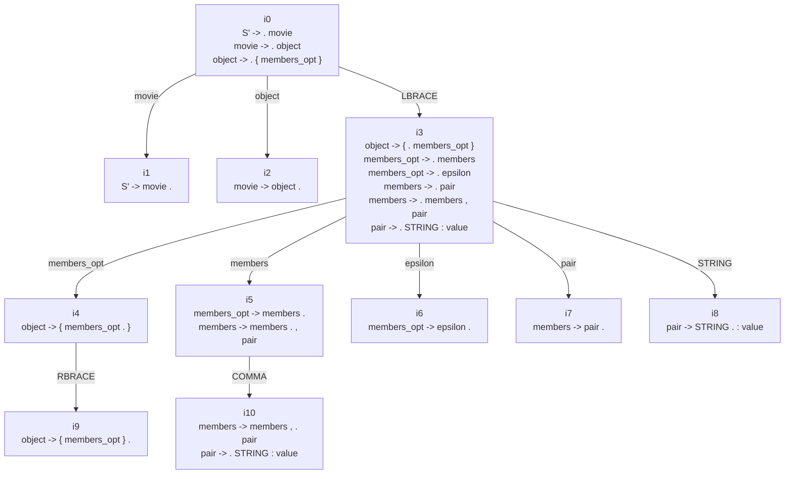

# Programming Assignment 1, Part 2

## Movie Parser With PLY

Course: CS 3383  
Team: David A. / Andres A. / Sol G.  
Repository: `https://github.com/axantillon/ply-project`  
Video Demo: `https://drive.google.com/file/d/134hyDCBIB0keIFPNNRSnOPZeeBNakIOR/view?usp=sharing`

Prepared with assistance from Codex (GPT-5.4).

## Contents

- [Repository Guide](#repository-guide)
- [PLY Lexer and Parser Implementation](#ply-lexer-and-parser-implementation)
- [How Parsed Information Is Kept in Memory](#how-parsed-information-is-kept-in-memory)
- [Functionality Using Parsed Data](#functionality-using-parsed-data)
- [Sample Input Files](#sample-input-files)
- [Validation and Demo Notes](#validation-and-demo-notes)
- [Context-Free Grammar (CFG)](#context-free-grammar-cfg)
- [First and Follow Sets](#first-and-follow-sets)
- [Partial LALR(1) Canonical Collection](#partial-lalr1-canonical-collection)
- [How the CFG Maps to the Code](#how-the-cfg-maps-to-the-code)
- [Conclusion](#conclusion)

## Repository Guide

The main files in the repository are:

- [`src/imdb_parser/parser.py`](src/imdb_parser/parser.py): PLY lexer, grammar rules, parse actions, parser construction, and parse entry points
- [`src/imdb_parser/models.py`](src/imdb_parser/models.py): `Movie` object construction and movie-specific semantic validation
- [`src/imdb_parser/catalog.py`](src/imdb_parser/catalog.py): loading many parsed records into a `MovieCatalog`
- [`tests/test_parser.py`](tests/test_parser.py): parser-focused automated tests
- [`samples/sample1.json`](samples/sample1.json), [`samples/sample2.json`](samples/sample2.json), [`samples/sample3.json`](samples/sample3.json): valid sample inputs
- [`samples/invalid_sample.json`](samples/invalid_sample.json): invalid input for rejection testing
- [`scripts/movie_cli.py`](scripts/movie_cli.py): command-line entry point for running the parser and inspecting outputs
- [`src/imdb_parser/query.py`](src/imdb_parser/query.py): example functionality over parsed data
- [`src/imdb_parser/webapp.py`](src/imdb_parser/webapp.py): browser-based exploration of the same parsed objects

Recommended reading order:

1. open [`src/imdb_parser/parser.py`](src/imdb_parser/parser.py)
2. compare it with the CFG section in this report
3. open [`src/imdb_parser/models.py`](src/imdb_parser/models.py) to see what is checked after parsing
4. open [`tests/test_parser.py`](tests/test_parser.py) and the files in [`samples/`](samples/) to see accepted and rejected examples
5. open [`scripts/movie_cli.py`](scripts/movie_cli.py) to see how the parser is exercised from the command line

## PLY Lexer and Parser Implementation

The parser is implemented in [`src/imdb_parser/parser.py`](src/imdb_parser/parser.py) using `ply.lex` and `ply.yacc`.

### Lexer

The lexer defines the following token types:

- `STRING`
- `NUMBER`
- `TRUE`
- `FALSE`
- `NULL`

JSON punctuation is handled through PLY literals:

- `{`
- `}`
- `[`
- `]`
- `:`
- `,`

This is an appropriate design for JSON because the punctuation symbols are structural markers and do not need separate semantic payloads.

The token actions convert input text directly into Python values:

- `t_STRING` uses `json.loads(...)` so escaped quotes and Unicode escapes are interpreted correctly
- `t_NUMBER` produces either `int` or `float`
- `t_TRUE`, `t_FALSE`, and `t_NULL` map directly to `True`, `False`, and `None`

Whitespace is ignored through `t_ignore`, newline positions are tracked with `t_newline`, and invalid characters are rejected by `t_error`.

### Parser

The parser is built with:

```python
parser = yacc.yacc(start="movie", outputdir=str(_THIS_DIR))
```

The explicit start symbol is important. The grammar can recognize nested JSON values, but the accepted top-level input for this project is restricted to:

```text
movie -> object
```

That matches the domain of the assignment, where each movie record is one JSON object.

### Nonterminals and Productions

The grammar is organized around standard JSON structure:

- `movie`
- `object`
- `members_opt`
- `members`
- `pair`
- `array`
- `elements_opt`
- `elements`
- `value`

Two design choices matter here.

First, `members_opt` and `elements_opt` use epsilon productions. This allows empty objects and arrays without introducing special-purpose parsing rules.

Second, comma-separated sequences are represented recursively:

- `members -> members , pair`
- `elements -> elements , value`

This is a clean CFG formulation and works naturally with bottom-up parsing.

### Parse Actions

The parse actions construct the final in-memory representation directly during reduction:

- `p_object` produces a Python dictionary
- `p_pair` produces a `(key, value)` pair
- `p_members_single` and `p_members_multi` accumulate object members
- `p_array` produces a Python list
- `p_elements_single` and `p_elements_multi` accumulate array elements
- `p_value` passes through primitive or nested values

This means the implementation performs syntax-directed translation while parsing. The code does not build a separate explicit parse tree class. Instead, it reduces directly to Python data structures that can be passed to the rest of the project.

### Error Handling

Syntax-level failures are reported in the parser layer:

- illegal characters are rejected by `t_error`
- malformed token sequences are rejected by `p_error`
- end-of-file syntax failures are reported explicitly when `p is None`

The public parser entry points are:

- `parse_movie_json_raw(...)` for parsing into a raw Python mapping
- `parse_movie_json(...)` for parsing and then validating into a `Movie`

This split is useful because it separates pure parsing from application-specific validation.

## How Parsed Information Is Kept in Memory

After syntactic parsing succeeds, the parsed information is retained in memory in two stages.

### Raw Parsed Structure

[`src/imdb_parser/parser.py`](src/imdb_parser/parser.py) reduces the JSON input into Python dictionaries, lists, strings, numbers, booleans, and `None`. At this stage, the result is already an in-memory representation of the parsed input.

### Movie Objects

[`src/imdb_parser/models.py`](src/imdb_parser/models.py) converts the parsed mapping into a `Movie` object through `Movie.from_mapping(...)`.

This stage performs semantic validation such as:

- required fields must exist
- `tconst` must begin with `tt`
- `genres` must be a list of strings
- optional movie fields must have valid types

This design deliberately keeps syntax and semantics separate:

- the PLY grammar checks structural validity
- the `Movie` model checks movie-specific meaning

### Collections of Parsed Movies

[`src/imdb_parser/catalog.py`](src/imdb_parser/catalog.py) stores multiple `Movie` objects in memory as a `MovieCatalog`. It can load:

- a single JSON file
- a directory of JSON files
- a JSONL dataset

The larger datasets used by the CLI and web interface are derived from the IMDb public dataset `title.basics.tsv.gz`, which is downloaded and normalized by [`scripts/build_imdb_medium_jsonl.py`](scripts/build_imdb_medium_jsonl.py). That pipeline filters the source data to records with `titleType == "movie"` and rewrites each row as a JSON object with fields such as `tconst`, `titleType`, `primaryTitle`, `originalTitle`, `isAdult`, `startYear`, `endYear`, `runtimeMinutes`, `genres`, and `synopsis`.

This satisfies the assignment requirement that the parsed information remain in memory using objects or data structures after parsing is complete.

## Functionality Using Parsed Data

The assignment requires at least one specific functionality using the parsed data. This project implements more than one, but the clearest examples are:

- validation of one movie file through [`scripts/movie_cli.py`](scripts/movie_cli.py)
- parsing and display of one movie file through [`scripts/movie_cli.py`](scripts/movie_cli.py)
- structured search over parsed movies through [`src/imdb_parser/query.py`](src/imdb_parser/query.py)

Example:

```bash
python3 scripts/movie_cli.py find --dataset samples --genre Sci-Fi
```

In that flow:

1. the CLI loads the input path
2. [`src/imdb_parser/catalog.py`](src/imdb_parser/catalog.py) parses the records into `Movie` objects
3. [`src/imdb_parser/query.py`](src/imdb_parser/query.py) filters the in-memory collection
4. the matching parsed records are displayed

When a processed JSONL dataset is used instead of the small hand-written samples, the records come from the normalized IMDb pipeline in [`scripts/build_imdb_medium_jsonl.py`](scripts/build_imdb_medium_jsonl.py), and each line of the dataset is one complete movie JSON object in the same schema accepted by the parser.

The project also includes a browser interface in [`src/imdb_parser/webapp.py`](src/imdb_parser/webapp.py). That layer is secondary to the parser and serves as an additional interface over the same parsed data.

## Sample Input Files

The required complete sample inputs are:

- [`samples/sample1.json`](samples/sample1.json)
- [`samples/sample2.json`](samples/sample2.json)
- [`samples/sample3.json`](samples/sample3.json)

The repository also includes:

- [`samples/invalid_sample.json`](samples/invalid_sample.json)

These files provide concrete accepted inputs, a rejected input, and examples that can be compared against the CFG.

## Validation and Demo Notes

The parser behavior can be checked with the CLI.

Valid sample:

```bash
python3 scripts/movie_cli.py validate samples/sample1.json
```

Invalid sample:

```bash
python3 scripts/movie_cli.py validate samples/invalid_sample.json
```

Parse and display:

```bash
python3 scripts/movie_cli.py parse samples/sample1.json
```

Search using parsed data:

```bash
python3 scripts/movie_cli.py find --dataset samples --genre Sci-Fi
```

Automated parser tests are located in [`tests/test_parser.py`](tests/test_parser.py) and can be run with:

```bash
python3 -m unittest tests.test_parser
```

The code sequence used in the video walkthrough is:

1. [`src/imdb_parser/parser.py`](src/imdb_parser/parser.py)
2. [`src/imdb_parser/models.py`](src/imdb_parser/models.py)
3. [`tests/test_parser.py`](tests/test_parser.py)
4. [`scripts/movie_cli.py`](scripts/movie_cli.py)

## Context-Free Grammar (CFG)

The CFG for the parser is:

```text
S' -> movie
movie -> object
object -> { members_opt }
members_opt -> members
members_opt -> epsilon
members -> pair
members -> members , pair
pair -> STRING : value
array -> [ elements_opt ]
elements_opt -> elements
elements_opt -> epsilon
elements -> value
elements -> elements , value
value -> STRING
value -> NUMBER
value -> object
value -> array
value -> TRUE
value -> FALSE
value -> NULL
```

### CFG Explanation

- `movie -> object`
  The accepted top-level input is one JSON object.

- `object -> { members_opt }`
  Objects are delimited by braces and may be empty or non-empty.

- `members_opt -> members | epsilon`
  Objects can contain members or no members.

- `members -> pair | members , pair`
  Object members are comma-separated key-value pairs.

- `pair -> STRING : value`
  Each member consists of a string key and a value.

- `array -> [ elements_opt ]`
  Arrays are delimited by brackets and may be empty or non-empty.

- `elements_opt -> elements | epsilon`
  Arrays can contain elements or no elements.

- `elements -> value | elements , value`
  Array elements are comma-separated values.

- `value -> STRING | NUMBER | object | array | TRUE | FALSE | NULL`
  A value can be primitive or nested.

This grammar is intentionally close to standard JSON, with the additional project choice that the start symbol restricts the entire file to a top-level object.

## First and Follow Sets

The following First and Follow sets summarize the nonterminals used by the grammar.

| Non-Terminal | First | Follow |
| --- | --- | --- |
| `S'` | `{` | `$` |
| `movie` | `{` | `$` |
| `object` | `{` | `$`, `}`, `,`, `]` |
| `members_opt` | `epsilon`, `STRING` | `}` |
| `members` | `STRING` | `}`, `,` |
| `pair` | `STRING` | `}`, `,` |
| `array` | `[` | `}`, `,`, `]` |
| `elements_opt` | `epsilon`, `STRING`, `NUMBER`, `{`, `[`, `TRUE`, `FALSE`, `NULL` | `]` |
| `elements` | `STRING`, `NUMBER`, `{`, `[`, `TRUE`, `FALSE`, `NULL` | `]`, `,` |
| `value` | `STRING`, `NUMBER`, `{`, `[`, `TRUE`, `FALSE`, `NULL` | `}`, `,`, `]` |

## Partial LALR(1) Canonical Collection

The following presentation organizes the beginning of the canonical collection in the same style as the supporting class material: initial closure with transitions, then the first 10 states, followed by a navigation map.

### Closure and Transitions

| Closure of `S'` (`i0`) | Transitions |
| --- | --- |
| `S' -> . movie`<br>`movie -> . object`<br>`object -> . { members_opt }` | `movie -> i1`<br>`object -> i2`<br>`{ -> i3` |

### First 10 States

| State | Items | State | Items |
| --- | --- | --- | --- |
| `i1` | `S' -> movie .` | `i2` | `movie -> object .` |
| `i3` | `object -> { . members_opt }`<br>`members_opt -> . members`<br>`members_opt -> . epsilon`<br>`members -> . pair`<br>`members -> . members , pair`<br>`pair -> . STRING : value` | `i4` | `object -> { members_opt . }` |
| `i5` | `members_opt -> members .`<br>`members -> members . , pair` | `i6` | `members_opt -> epsilon .` |
| `i7` | `members -> pair .` | `i8` | `pair -> STRING . : value` |
| `i9` | `object -> { members_opt } .` | `i10` | `members -> members , . pair`<br>`pair -> . STRING : value` |

### Navigation Map

The following Mermaid diagram shows the navigation among the first 10 states.



This partial collection is sufficient to satisfy the requirement to include at least 10 states and to illustrate how parsing begins from the start symbol and expands into object-member structure.

## How the CFG Maps to the Code

The mapping between theory and implementation is intentionally direct.

- `STRING`, `NUMBER`, `TRUE`, `FALSE`, and `NULL` in the CFG correspond to lexer token definitions in [`src/imdb_parser/parser.py`](src/imdb_parser/parser.py)
- `{`, `}`, `[`, `]`, `:`, and `,` correspond to PLY literals in [`src/imdb_parser/parser.py`](src/imdb_parser/parser.py)
- the CFG productions correspond to parser functions such as `p_object`, `p_pair`, `p_array`, `p_members_multi`, and `p_elements_multi` in [`src/imdb_parser/parser.py`](src/imdb_parser/parser.py)
- the start symbol `movie` is enforced by `yacc.yacc(start="movie", ...)`
- syntax errors are handled in the lexer/parser layer, while semantic movie constraints are handled in [`src/imdb_parser/models.py`](src/imdb_parser/models.py)

This separation is one of the main design choices of the project. A malformed JSON structure is a parsing problem, but a structurally valid object with missing required movie fields is a semantic validation problem. Keeping those concerns separate makes the parser easier to explain and makes the codebase easier to inspect.

## Conclusion

This project delivers a PLY-based parser for JSON movie records, stores the parsed results in memory through Python objects and collections, and demonstrates concrete functionality over those parsed results. The repository is organized so that the lexer, grammar, semantic validation, sample inputs, and test cases can be inspected directly through the linked files above.
